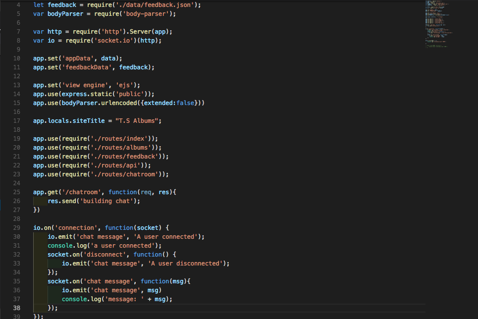

<h1>T.S Albums</h1>

<h2>Introduction</h2>
This is a back-end project which consist on a website where you can find all the information of Taylor Swift's albums, this features a feedback and a chat sections.

<h2>Technologies Used</h2>
<li>Node.js</li>
<li>Express</li>
<li>EJS</li>
<li>Body Parser</li>
<li>Socket.io</li>

<h2>Example Code</h2>
To see the full code, please visit <a href="https://github.com/melycm/myApp--week8">T.S Albums</a> on Github.

<h2>Video</h2>
<a href="https://www.youtube.com/watch?v=6RSOrFk6Vgo" target="_blank">See the demo of the game</a>

<h2>Author</h2>
Cantu, Melissa

<h2>Acknowledgments</h2>
I would like to thank Veronica Lino and our TA, Matthew Baxter for all the help on this project.